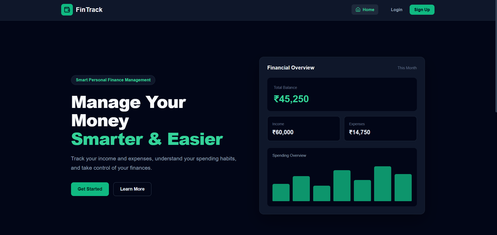
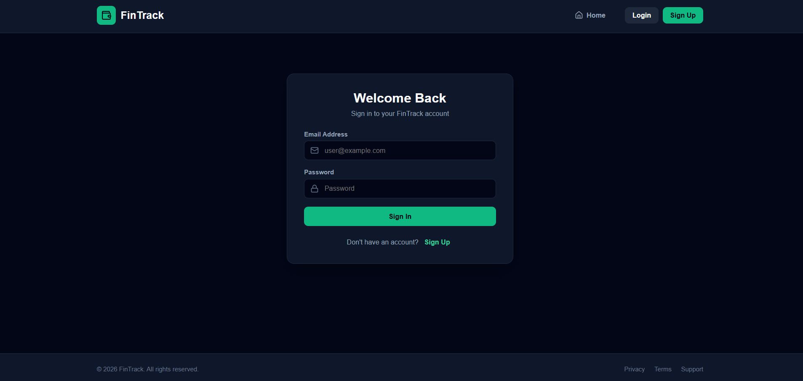
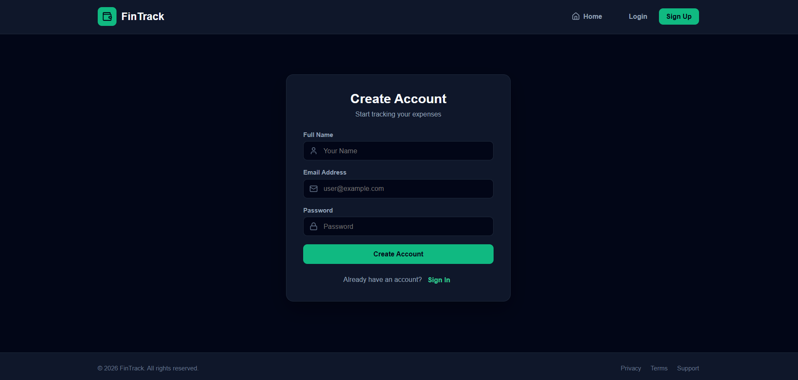
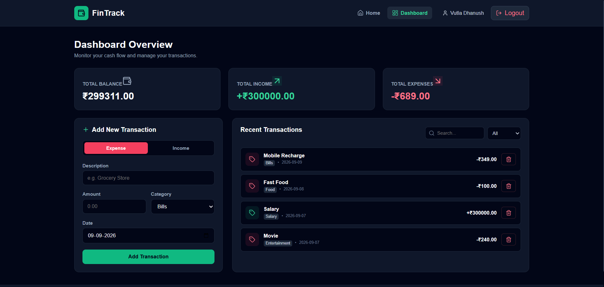

# FinTrack - Expense Tracker

FinTrack is a full-stack Expense Tracker application built using Java Spring Boot and React.js.

The application allows users to manage their income, expenses, categories, and financial transactions through a simple and user-friendly interface.
## Features

- User Signup and Login
- JWT-based Authentication
- BCrypt Password Encryption
- Add Income Transactions
- Add Expense Transactions
- Create and Manage Categories
- View Transaction History
- Update Transactions
- Delete Transactions
- Track Total Income
- Track Total Expenses
- Calculate Current Balance
- User-specific Transactions
- RESTful APIs
- MySQL Database
- Input Validation
## Application Screenshots

### Home Page

### Login Page

### Signup Page

### Dashboard

### API Testing

## Tech Stack

### Backend

- Java
- Spring Boot
- Spring Security
- Spring Data JPA
- Hibernate
- JWT Authentication
- BCrypt
- Maven
- MySQL

### Frontend

- React.js
- JavaScript
- HTML
- CSS
- Vite
- Lucide React

### Tools

- IntelliJ IDEA
- Visual Studio Code
- Postman
- Git
- GitHub
